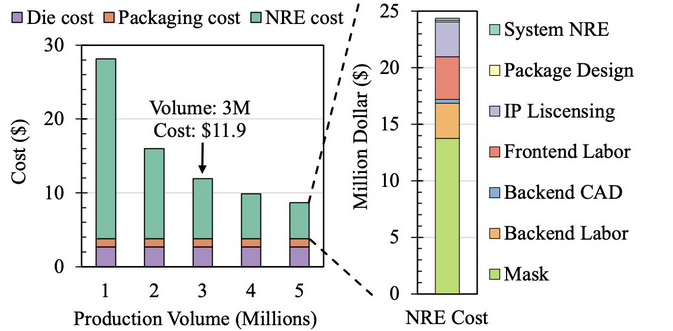

+++
title = "PIM Is All You Need: A CXL-Enabled GPU-Free System for Large Language Model Inference"

[[extra.authors]]
name = "Nat Rurka (Presenter & Blogger)"

[[extra.authors]]
name = " Adam Bobich (Blogger)" 

[[extra.authors]]
name = "Isaac Lonergan (Scribe & Blogger)"

[[extra.authors]]
name = "Darren Mai"

[[extra.authors]] 
name = 'Mykyta Syntsia'

[[extra.authors]] 
name = "Sam Shaaban"

[[extra.authors]] 
name = "Shubhangi Pandey"
+++

# Main Problems

## Carbon Footprint of Inference

According to a 2022 paper from Meta[[1]](https://proceedings.mlsys.org/paper_files/paper/2022/file/462211f67c7d858f663355eff93b745e-Paper.pdf), the carbon footprint of inference is about two times as great as that of training a model, which is part of why this paper focuses so heavily on the inference phase.

## Rising Inference Costs

The price per million tokens for API calls to OpenAI’s models at the time increased strongly with the complexity of the task. At the time, GPT-4o audio model had pricing of $10 per 1 million output tokens of text, and $80 per million tokens of audio output. They found that at an input and output lengths of 2048 tokens, over 80% of end-to-end latency was spent on the decoding, or text generation time, with the rest of that being context analysis.

## Low GPU Utilization

Due to the way that general matrix multiplication functions for LLM inference, operational intensity, or the required amount of compute per byte of memory processed, is low. CENT found that the best way to make up for this is by increasing memory bandwidth, to make up for wasted compute time.

## High Memory Utilization by KV Caches

A model such as Llama 70B’s weights take up as much 140GB of memory space, but that isn’t the main focus. Another issue that leads to low GPU utilization is that KV caches take up vast amounts of memory, as each query needs its own KV cache, as the Self-Attention phase of a transformer operates on KV cache.

Larger context windows cause increased KV cache sizes, filling memory, meaning smaller batch sizes, and less parallelizable computation, and thus lower operational intensity.

# **C**XL-**EN**abled GPU-Free sys**T**em (CENT)

## Processing In Memory

Processing in memory (PIM) can be used to increase the bandwidth of memory, while offering enough computing power for the AI model. This is accomplished by placing a near memory processing unit (PU) adjacent to DRAM banks within memory chips. Using a PU in a memory chip will often decrease the memory density inside of that chip. Large language models have large memory requirements, so this decrease in density could be harmful.

## Compute eXpress Link (CXL)

CENT uses CXL memory expansion to increase the capacity when using PIM. The CENT implementation specifies that the CXL device should contain 16 memory chips, with each chip containing two GDDR6-PIM channels. Each of these CXL devices also have a processing near memory (PNM) near the memory as well. The use of PIM and PNM is supposed to eliminate the need for more expensive GPUs. An NVIDIA Ampere A100 80GB has a memory bandwidth of 2TB/s, but their potential architecture of GDDR6-PIM devices will have 16TB/s peak memory bandwidth each.

## CXL Switch

Adding a CXL switch to the system will allow multiple CXL cards to communicate with each other and the host system. This allows for higher scalability of memory capacity while still proportionally increasing the computational power of the system. 

# Parallelism Strategies

CENT supports three mapping strategies to distribute LLMs across devices:

**Pipeline Parallelism (PP):** Each transformer block is assigned to a pipeline stage across CXL devices. Multiple prompts execute concurrently in different stages. This maximizes throughput for serving large user bases.

**Tensor Parallelism (TP):** A single transformer block is distributed across all CXL devices. The embedding vector is broadcast before each fully-connected layer, and partial results are gathered afterward. This minimizes latency for real-time applications.

**Hybrid TP-PP:** Balances throughput and latency by allocating each decoder to a subset of devices. For example, with 32 devices, a TP=8/PP=4 split allows both some parallelism within each block and pipelining across blocks.

# Evaluation

For evaluation of performance, the CENT team utilized a workload mapper for LLM inference, which were broken down into CENT’s custom instructions, then fed into a trace generator, which  were then further broken down to be compatible with Ramulator 2.0[[2]](https://people.inf.ethz.ch/omutlu/pub/Ramulator2_arxiv23.pdf)’s instructions. Ramulator 2.0 was used for cycle accurate simulation, and then at last, CXL communication latencies were applied to give a more realistic result of processing time and performance.

For power modeling, they utilized Micron’s DRAM Power Model[[3]](https://www.micron.com/sales-support/design-tools/dram-power-calculator) which provided relatively accurate expected wattage for their system.

When it comes to cost evaluation, they predicted that the cost of PIM DRAM will be about 10x as high as standard DRAM based on UPMEM, a form of PIM DRAM based on DDR4, combined with the nonrecurrent engineering costs of a custom design, the die manufacturing cost, and packaging cost.

# Results

CENT was evaluated against 4× NVIDIA A100 80GB GPUs running Llama2-7B, 13B, and 70B via vLLM, at matched average power. The headline results:
- **2.3× higher end-to-end throughput** in the throughput-critical setting (GPU batch=128, CENT using pipeline parallelism)
- **4.6× lower end-to-end latency** in the latency-critical setting (batch=1)
- **2.3× more energy-efficient** (tokens per joule)
- **5.2× more tokens per dollar** due to CENT's 2.5× cheaper Total Cost of Ownership

The A100 hardware cost in the evaluation is approximately $42,000, versus roughly $15,000 for an equivalent CENT system. CENT's advantage grows further with longer context windows: at 32K context, it achieves up to 3.3× throughput speedup in decoding because GPUs are forced to shrink batch sizes to fit KV caches while CENT's larger memory (512GB vs 320GB) is less constrained.

The prefill stage is the one area where GPUs win: CENT shows 1.4× higher prefill latency because the compute-intensive GEMM operations of prefill favor GPU throughput. However, prefill accounts for only about 2% of total inference time across Llama2 models, so this disadvantage barely moves the end-to-end numbers.

# Class Discussion
- In the paper they said processing near memory cores are ooo risc v cores, could in order cores be better here?
  - Only 1% of operations go to pnm cores instead of pim cores, might not be enough of a benefit to switch.
- What is the core architecture for PNM
  - Berkeley ooo machine
    - Their reference to RISC-V OOO.
    - Might just be because it was there to simulate.
- They only talked about 16 bit floats, but 8 bit and smaller can work well for inference and the multiply and add blocks only support 16 bit floats. Seems inflexible
  - Eight bit float seems like it is low precision
    - Yes but it works for LLM inference. Accuracy is not a necessity in an application such as this.
    - Four bit is even used.
      - Results are already fuzzy; we do not need perfect precision.
  - They also use BF16, dont know the difference between 16 bit float types.	
    - Think it's just a naming convention in IEEE.
    - Developed by a research group at google.
    - There are a lot of similarly named things, is BF16 bfloat16?
    - Bfloat16 is different from IEEE half precision.
  - Work was only done on Llama models?
    - They have no data about the other model it seems.
  - Are they using standard linear kvcache or vllm
    - We believe that they did use vLLM, although it is a bit unclear from the paper.
- Very detailed cost breakdown, maybe a startup?
  - Radically different architecture and maybe it wont pan out.

# Conclusion

Overall, this paper seems like it may be the beginning of a pivotal change in how Large Language Model inference is served, lessening the need for GPUs, and ideally spreading the cost away from GPUs when it comes to consumer hardware.

If this concept is adopted, which seems likely considering the attention that this paper received, being accepted to ASPLOS in 2025, the cost of inference for LLMs may drop soon. Whether that cost reduction is passed to consumers or not, we may not know. Ideally, the ability for CENT to support vastly larger context windows should lead to improved model performance and accuracy in the future.

Regardless of where it goes, CENT is an interesting and thought provoking concept, finally making good use of PIM and PNM, which has struggled to find an appropriate, heavily latency-bound use case for many years. We hope that, even if not adopted, it will inspire further papers to research the idea of utilizing PIM.

# AI Disclosure

Claude was used to summarize the paper, notes, and class discussion. The generative AI created a template which was then reviewed, edited and revised by the group.